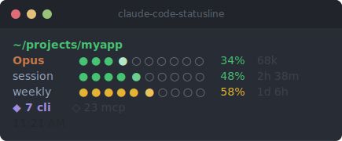

<h1 align="center">claude-code-statusline</h1>

<p align="center">
  <a href="https://www.npmjs.com/package/@brenoxp/cc-statusline"></a>
  <a href="https://www.npmjs.com/package/@brenoxp/cc-statusline"></a>
  <a href="https://github.com/brenoxp/claude-code-statusline/blob/master/LICENSE"></a>
</p>

<p align="center">
  Custom status line for <a href="https://docs.anthropic.com/en/docs/claude-code">Claude Code</a> CLI, showing real-time session info in the terminal.
</p>

<p align="center">
  <a href="#install">Install</a> &middot;
  <a href="#what-it-shows">What it shows</a> &middot;
  <a href="#settings">Settings</a> &middot;
  <a href="#development">Development</a>
</p>

---

<p align="center">
  
</p>

## What it shows

- Working directory (middle-ellipsis truncation), git branch, diff stats (+/- lines)
- Model name, context window progress bar (gradient fill, inverse highlight at 80%+), token count
- Cache write tokens per session (✎ indicator)
- 5-hour session rate limit with countdown (inverse at 90%+)
- 7-day weekly rate limit with countdown
- Number of running Claude Code CLI sessions
- Number of MCP servers running across all sessions
- Session tasks: last completed + current in progress
- Last user prompt (truncated, voice input indicator)
- Clock (12h)

## Requirements

- macOS (process detection uses BSD `ps`/`pgrep`/`stty` flags)
- [Bun](https://bun.sh/) (recommended) or Node.js 18+
- Terminal with truecolor (24-bit) support

The `cc-statusline` bin is a tiny shell wrapper that picks bun if it's on PATH, else node. nib-ink uses `Bun.stringWidth` on its unicode width fallback path; under node, a built-in polyfill counts code points instead — works for all input but under-counts wide chars (CJK, emoji), which can cause off-by-one truncation. Install bun for pixel-perfect rendering when prompts contain wide chars; otherwise node is fine.

## Install

```bash
npm install -g @brenoxp/cc-statusline
```

Add to `~/.claude/settings.json`:

```json
{
  "statusLine": {
    "type": "command",
    "command": "cc-statusline"
  }
}
```

<details>
<summary>Install from source</summary>

Requires [Bun](https://bun.sh/).

```bash
git clone https://github.com/brenoxp/claude-code-statusline.git
cd claude-code-statusline
bun install
bun run build
```

```json
{
  "statusLine": {
    "type": "command",
    "command": "bun /path/to/claude-code-statusline/dist/index.js"
  }
}
```

</details>

## Settings

`settings.json` in the project root:

| Setting | Default | Description |
|---------|---------|-------------|
| `maxLineWidth` | `70` | Cap line width (useful on wide terminals) |
| `cacheWrite` | `true` | Show session cache write tokens on the model line |
| `minPromptLineWidth` | `40` | Minimum width for the prompt line |
| `debug` | `false` | Timing info to stderr |
| `testMode` | `false` | Read from example input instead of stdin |
| `log` | `false` | Save each stdin JSON input to `logs/` |

Env var overrides: `STATUSLINE_DEBUG`, `TEST_MODE`, `STATUSLINE_LOG`.

## Usage data

Rate limit data comes straight from the `rate_limits` field in the stdin JSON that Claude Code sends each render (no network, no token needed). The session/weekly bars only appear for Pro/Max subscribers, and only after the first API response of a session.

## Development

```bash
bun run build                    # build dist/index.js
bun run test                     # run test suite
bun run format                   # format code
bun run lint                     # lint
TEST_MODE=true bun dist/index.js # manual render check
bash benchmark/run.sh            # performance benchmark
```

## Architecture

Built with [nib-ink](https://github.com/brenoxp/nib-ink) (Svelte 5 terminal UI renderer). Components in `src/components/` use flexbox layout via Yoga, compiled and bundled via esbuild into a single `dist/index.js` with zero runtime dependencies.

```
src/
├── components/     Svelte 5 components (Statusline, Location, ContextBar, ...)
├── lib/
│   ├── data.ts     Data gathering (git, processes, tasks, prompt, rate limits)
│   └── theme.ts    Colors, utilities, cache helpers
└── index.ts        Entry point (stdin → renderToString → stdout)
```

## License

MIT
